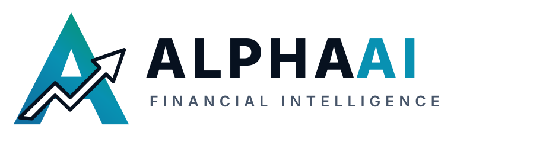
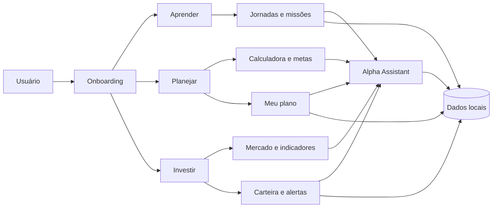

<picture>
  <source media="(prefers-color-scheme: dark)" srcset="assets/brand/alphaai-logo-dark.svg">
  <source media="(prefers-color-scheme: light)" srcset="assets/brand/alphaai-logo-light.svg">
  
</picture>

### Educação financeira para organizar, aprender e decidir com mais consciência

[Estudo de caso](docs/CASE_STUDY.md) · [Arquitetura](docs/ARCHITECTURE.md) · [Roadmap](docs/ROADMAP.md) · [LinkedIn](https://www.linkedin.com/in/jhonyhvieira/)

---

## Sobre esta vitrine

Este repositório apresenta o **AlphaAI**, meu principal projeto pessoal. O código-fonte permanece privado durante o desenvolvimento; aqui estão documentados o problema, as decisões de produto, a experiência criada e a arquitetura geral da solução.

O AlphaAI nasceu para tornar a educação financeira menos confusa. Em vez de começar por gráficos e recomendações, a plataforma primeiro ajuda a pessoa a entender sua situação, organizar prioridades e aprender no próprio ritmo. As ferramentas de mercado entram depois, como apoio ao estudo.

> Primeiro organizamos a vida financeira. Depois ensinamos investimentos.

---

## O que o produto reúne

| Área | Experiência |
|---|---|
| **Aprender** | Jornada personalizada, missões, progresso, XP e conteúdos em linguagem acessível |
| **Planejar** | Calculadora educativa para reserva, metas e cenários de crescimento |
| **Meu plano** | Uma prioridade financeira ativa, progresso e indicação do próximo passo |
| **Alpha Assistant** | Assistente que explica conceitos e ajuda o usuário a encontrar o módulo adequado |
| **Mercado** | Histórico de ativos, indicadores técnicos, gráficos e ferramentas de estudo |
| **Carteira e alertas** | Acompanhamento local de posições, concentração e eventos relevantes |

O sistema não envia ordens, não promete rentabilidade e não substitui aconselhamento financeiro profissional. O objetivo é exclusivamente educativo.

---

## Mapa do produto

---

## Decisões que orientam o projeto

- **Educação antes de recomendação:** cada recurso precisa explicar o contexto antes de apresentar números.
- **Linguagem simples:** termos técnicos só aparecem quando ajudam a compreensão.
- **Privacidade local:** perfil, progresso, plano e carteira ficam armazenados localmente.
- **Próximo passo claro:** a interface evita excesso de informação e mostra a ação mais importante naquele momento.
- **Arquitetura por domínio:** aprendizado, planejamento, assistente, mercado e carteira são módulos separados.
- **Qualidade contínua:** testes automatizados e verificações no GitHub Actions acompanham a evolução do produto.

---

## Tecnologias

| Camada | Ferramentas |
|---|---|
| Interface | Streamlit, HTML e CSS |
| Aplicação | Python |
| Dados locais | SQLite e arquivos estruturados |
| Visualização | Plotly |
| Dados de mercado | APIs e serviços de coleta |
| Qualidade | Testes automatizados, compilação e GitHub Actions |
| Versionamento | Git e GitHub |

---

## O que este projeto demonstra

O AlphaAI combina desenvolvimento de software, análise de dados e visão de produto. Durante a construção, trabalho com:

- definição e priorização de funcionalidades;
- modelagem de dados e persistência local;
- construção de dashboards e interfaces interativas;
- integração entre módulos com diferentes responsabilidades;
- testes automatizados e pipeline de qualidade;
- escrita de documentação técnica e de produto;
- cuidados éticos ao apresentar informações financeiras.

---

## Demonstração visual

As capturas reais da aplicação serão publicadas nesta seção conforme as telas forem preparadas para apresentação pública. A estrutura para adicionar as imagens já está disponível em [`assets/screenshots`](assets/screenshots/README.md).

---

## Status

A base do produto já inclui aprendizado personalizado, calculadora financeira, plano guiado, Alpha Assistant, ferramentas de mercado, carteira local e testes automatizados. O desenvolvimento atual está concentrado no refinamento da experiência, ampliação das jornadas educativas e preparação de uma demonstração pública.

Consulte o [roadmap público](docs/ROADMAP.md) para acompanhar as próximas etapas.

---

## Autor

Projeto idealizado e desenvolvido por **Jhony Vieira**, estudante de Ciência de Dados e Administração.

---

**AlphaAI — aprender, organizar e decidir com consciência.**

