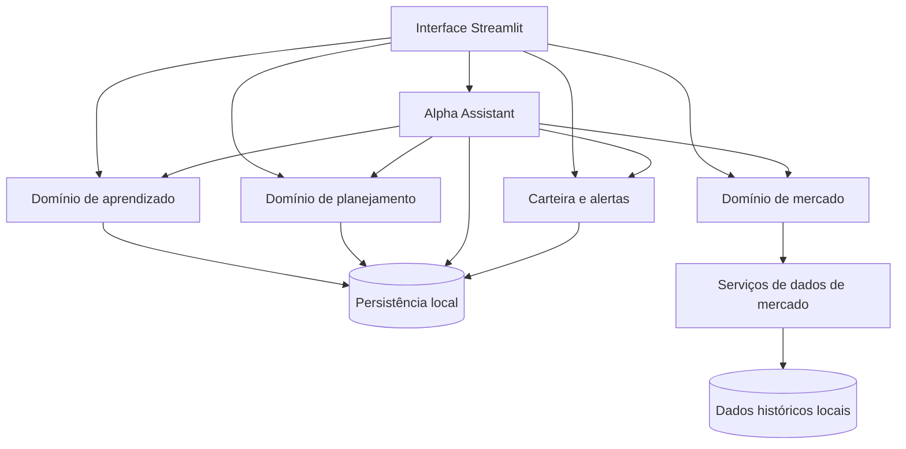
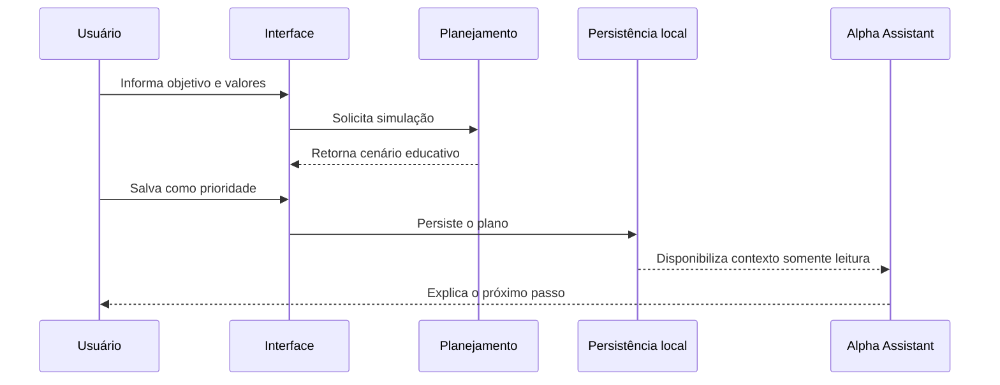

# Arquitetura pública do AlphaAI

Esta documentação apresenta a organização conceitual do produto sem expor o código-fonte privado.

## Visão geral

## Camadas

### Interface

Responsável pela navegação, apresentação de conteúdos, formulários, gráficos e feedback ao usuário. A interface é construída em Streamlit com componentes visuais complementares em HTML e CSS.

### Domínios de negócio

A aplicação é separada por responsabilidade:

- **Aprendizado:** perfis, jornadas, missões, progresso e conquistas;
- **Planejamento:** calculadora, metas e prioridade financeira ativa;
- **Assistant:** interpretação de intenções, explicações e navegação contextual;
- **Investimentos:** mercado, indicadores, ranking e análise histórica;
- **Carteira:** posições, concentração, resultado e alertas;
- **Persistência:** banco local e arquivos estruturados.

### Dados

O produto trabalha com dois grupos de dados:

1. **Dados pessoais locais**, como perfil, progresso, plano e carteira;
2. **Dados públicos de mercado**, coletados por serviços externos e usados para estudo.

Informações pessoais não são publicadas no GitHub e não precisam ser enviadas a um servidor central para o funcionamento básico.

## Fluxo de uma ação

Exemplo: criação de uma meta financeira.

## Qualidade

A evolução do produto é apoiada por:

- testes automatizados para regras e fluxos importantes;
- verificação de dependências;
- compilação dos módulos Python;
- execução automática das verificações no GitHub Actions;
- documentação de visão, arquitetura e padrões educacionais.

## Princípios técnicos

- módulos pequenos e com responsabilidades claras;
- baixo acoplamento entre domínios;
- persistência isolável para testes;
- segredos e dados pessoais fora do versionamento;
- degradação segura quando serviços externos não estão disponíveis;
- separação entre cálculo, conteúdo educativo e apresentação visual.

---

[Voltar para a apresentação](../README.md)
